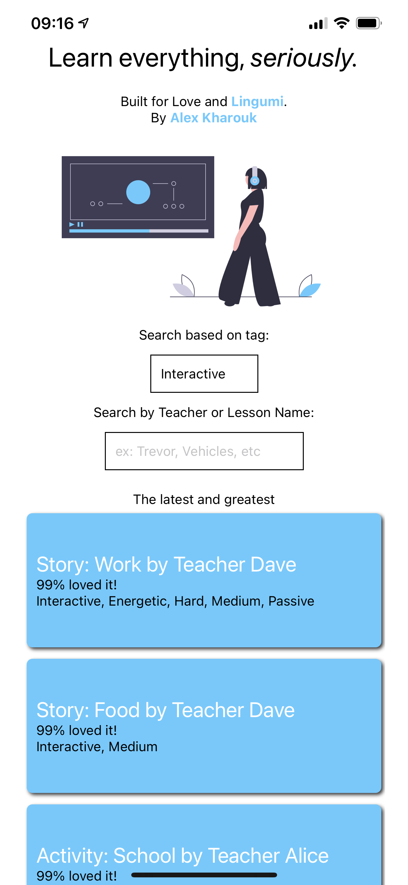

# World's best tutorial platform

> Learn everything, <em>seriously</em>.

## Preview App

If you have Expo installed on your phone, you can scan the QR code [here](https://expo.io/@alexkharouk/LingumiEdPlatform) to preview the application on your phone. Otherwise, here's a [built web version](https://ed-tech-platform.vercel.app/) that you can preview in the browser. Please keep in mind that this was built for mobile using [React Native](https://reactnative.dev/), so some features, like _RefreshControl_, do not work in the web version.

## Build for yourself

#### Clone the app

`git clone https://github.com/Kharouk/EdPlatform.git && cd EdPlatform`

#### Install dependencies

`npm i` or `yarn`

#### Run the app

`npm start` or `yarn start`

#### If you have Expo Go on your mobile device, scan the barcode. Otherwise click **Run in web browser**

#### Run tests (tests can be found within the /utils directory)

`npm test`

## Approach

- Enjoyed revisiting React Native after a long hiatus. Worked with React commercially for almost 3 years so thought I'd try to React Native instead for a bonus challenge.
- Decided to keep it simple however and just use `Expo` as a way to build the application. Thought it would be easier to share as well once I finished the challenge.
- Implementing the logic was a faster process than designing the application, it was interesting to learn about React Native through their documentation and how the component hierarchy is structured.

## Improvements

Some things I would implement or improve if I had more time (which I wish I did as I enjoyed building this out).

1. Each Video tutorial would have it's own page, with more information about the tutorial such as description or comments
2. Engagement within the platform; creating accounts, favorite videos, comments, affecting the ratings
3. Better GRID layout and more engaging UI
4. Have the two search boxes work in unison so that you can search for a teacher name as well as get the tags of videos associated to that teacher
5. Search by multiple tags at a time.
6. Relationships:
   - Building a relational structure that matches videos to teacher IDs
   - having a teachers page that shows all the related videos to that teacher
7. Building all these components that are UI focused made me realise how important it would be to have a tool like **Storybook** to help use with testing purposes and faster development.

I would also eject from using Expo so that I was dealing with essentially the native versions for both Android and IOS. I would then use a potential cloud storage to handle potential authentication features.

We would also migrate from using a base JSON file as the data structure to store all our video metadata as that would get far too big. I would use something like **AWS Amplify** to get us started as we are already in the ecosystem and can scale from there.
